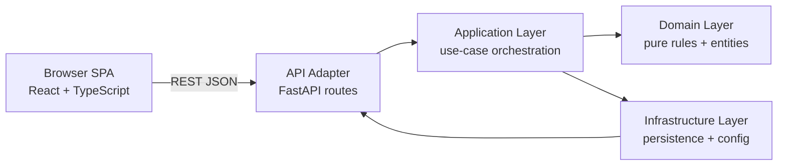

# ARCHITECTURE — `intervals-spa`

## 1. Purpose & Scope

**Goals:**
- Provide a responsive SPA for creating, viewing, and analysing training interval workouts.
- Keep business rules testable and isolated from HTTP and UI concerns.
- Serve a stable JSON API that the SPA and future integrations can consume.

**System boundaries:**
- In scope: interval/workout management, training-zone modelling, REST API, React SPA.
- Out of scope: wearable device sync, live telemetry, social features, coaching AI.

**Design constraints:**
- Offline-capable frontend (service-worker ready architecture).
- Deterministic API — identical request payloads yield identical responses.
- No hidden mutable global state.
- Installed frontend must work from a static-asset build served by Nginx (no Node.js runtime on the server).

---

## 2. High-Level Architecture Overview



**Component responsibilities:**
- **Browser SPA:** collect user input, call REST endpoints via typed API client, render results using the documented style guide.
- **API adapter (`src/intervals/api/`):** thin FastAPI routes — validate HTTP input, call application services, map exceptions to HTTP error responses.
- **Application layer (`src/intervals/application/`):** coordinate validation + domain services, return response DTOs.
- **Domain layer (`src/intervals/domain/`):** entities, value objects, invariants, and pure calculation logic.
- **Infrastructure layer (`src/intervals/infrastructure/`):** config loading, persistence adapters, external I/O.

---

## 3. Architectural Principles

- **Determinism:** identical inputs always yield identical outputs.
- **Explicit I/O:** all inputs come from HTTP/config; all outputs are typed DTOs, then rendered.
- **Pure domain functions:** domain services are side-effect free.
- **Dependency direction:** `api → application → domain`; infrastructure is adapter-only.
- **No circular imports:** enforced by module conventions and lint.
- **Thin adapters:** both HTTP and (future) CLI adapters stay thin and reuse the same application contracts.

---

## 4. Project Structure

```text
intervals-spa/
  pyproject.toml          Python package configuration
  frontend/
    package.json          Node package configuration
    vite.config.ts        Vite build + dev-proxy config
    src/
      api/                Typed fetch client modules
      components/         Reusable UI components
      hooks/              Custom React hooks
      pages/              Route-level page components
      types/              Shared TypeScript types
  src/intervals/
    api/
      main.py             FastAPI app factory + entry point
      error_handlers.py   Domain-error → HTTP status mapping
      routers/            Route modules (health, workouts, …)
    application/
      contracts.py        Pydantic request/response DTOs (BoundaryModel)
      orchestration.py    Use-case service classes
      parsing.py          parse_contract() — maps Pydantic failures to ValidationError
      validation.py       Semantic validation guards
    domain/
      enums.py            Canonical enum definitions
      model.py            Core domain entities
      validation.py       Domain invariant checks (raise DomainRuleError)
    infrastructure/
      config.py           Settings loaded from env vars (pydantic-settings)
      workout_store.py    Persistence adapter (in-memory placeholder)
    shared/
      errors.py           Error hierarchy: ValidationError, DomainRuleError, …
      exit_codes.py       Canonical exit codes for script mode
  tests/
    unit/                 Fast isolated backend unit tests
    integration/          Backend integration tests (httpx + ASGI)
    e2e/                  End-to-end browser tests (Playwright)
  docs/                   Architecture, requirements, model, and style docs
  scripts/
    ralph/                Agentic workflow helpers
    checks/               Packaging and install verification scripts
```

---

## 5. API Contract

### Endpoint Summary

| Method   | Path                        | Auth | Description           |
|----------|-----------------------------|------|-----------------------|
| `GET`    | `/api/v1/health`            | No   | Health check          |
| `GET`    | `/api/v1/workouts`          | No   | List workouts         |
| `POST`   | `/api/v1/workouts`          | No   | Create workout        |
| `GET`    | `/api/v1/workouts/{id}`     | No   | Get workout by ID     |
| `PUT`    | `/api/v1/workouts/{id}`     | No   | Update workout        |
| `DELETE` | `/api/v1/workouts/{id}`     | No   | Delete workout        |

### Error Response Shape

```json
{
  "error": {
    "code": "validation_error | domain_rule_error | not_found | internal_error",
    "message": "Human-readable description"
  }
}
```

### HTTP Status Code Mapping

| Domain Error          | HTTP Status |
|-----------------------|-------------|
| `ValidationError`     | 400         |
| `DomainRuleError`     | 422         |
| `NotFoundError`       | 404         |
| `InfrastructureError` | 500         |

---

## 6. Canonical Request / Response Example

**POST `/api/v1/workouts`**

Request:
```json
{
  "name": "Threshold Tuesday",
  "training_type": "cycling",
  "planned_date": "2026-07-15",
  "intervals": [
    { "zone": "z1", "duration_seconds": 300 },
    { "zone": "z4", "duration_seconds": 1200, "target_watts": 280 },
    { "zone": "z1", "duration_seconds": 300 }
  ]
}
```

Response `201 Created`:
```json
{
  "id": "3fa85f64-5717-4562-b3fc-2c963f66afa6",
  "name": "Threshold Tuesday",
  "training_type": "cycling",
  "planned_date": "2026-07-15",
  "status": "planned",
  "total_duration_seconds": 1800,
  "intervals": [
    { "zone": "z1", "duration_seconds": 300, "target_watts": null },
    { "zone": "z4", "duration_seconds": 1200, "target_watts": 280 },
    { "zone": "z1", "duration_seconds": 300, "target_watts": null }
  ]
}
```

---

## 7. Frontend Architecture

### State Management

- Local component state via `useState` / `useReducer` for simple UI state.
- Custom hooks in `src/hooks/` for data fetching and side-effects.
- No global state library in Phase 1; introduce if complexity demands it.

### Routing

React Router v6 with a top-level `Layout` wrapper:

```
/                → redirect → /workouts
/workouts        → WorkoutsPage
/workouts/:id    → WorkoutDetailPage
*                → NotFoundPage
```

### API Client

All fetch calls go through typed modules in `src/api/`.
Components and hooks must not call `fetch` directly.

---

## 8. CI Pipeline

Three dependent jobs on every push / pull_request:

1. **quality:** ruff lint, mypy, pytest (backend) + eslint, tsc, vitest (frontend)
2. **build:** `uv build` (Python wheel) + `pnpm build` (frontend static assets)
3. **smoke:** install wheel into fresh venv, health-check the API

---

## 9. Future Evolution

- Replace in-memory `WorkoutStore` with SQLite (then PostgreSQL) adapter.
- Add authentication (JWT bearer tokens) for multi-user support.
- Add interval analytics domain service (TSS, IF, NP calculation).
- Integrate with intervals.icu or similar external data sources.
- Add Playwright e2e test suite.
