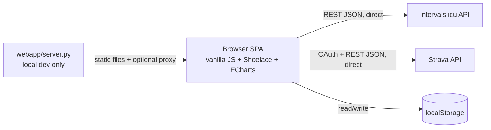

# ARCHITECTURE — `intervals-spa`

## 1. Purpose & Scope

**Goals:**
- Provide a browser-only dashboard for reviewing training activities, intervals, and glucose
  data pulled from intervals.icu (and optionally Strava).
- Keep all user data (settings, API keys, cached activities/intervals/glucose readings) on the
  user's own device.
- Require no server-side component to operate in production.

**System boundaries:**
- In scope: activity/interval search and caching, HR/pace/glucose visualisation, activity
  similarity search, CSV glucose import, Strava OAuth linking.
- Out of scope: any backend database, multi-user accounts, server-side persistence.

**Design constraints:**
- **No backend in production.** The deployed app (GitHub Pages) is static HTML/CSS/JS only and
  talks directly to `https://intervals.icu` and `https://www.strava.com` from the browser.
- All persistent state (settings, API keys, cached search results, glucose CSV imports) lives in
  `localStorage`. Nothing is sent to, or stored on, any server owned by this project.
- `webapp/server.py` exists **only** for local development — it serves the static files and,
  optionally, proxies API calls to work around CORS while testing on `localhost`. It is never
  deployed.

---

## 2. High-Level Architecture Overview


```mermaid
flowchart LR
  BROWSER[Browser SPA\nvanilla JS + Shoelace + ECharts] -->|REST JSON, direct| ICU[intervals.icu API]
  BROWSER -->|OAuth + REST JSON, direct| STRAVA[Strava API]
  BROWSER -->|read/write| LS[(localStorage)]
  DEV[webapp/server.py\nlocal dev only] -.->|static files + optional proxy| BROWSER
```

**Component responsibilities:**
- **Browser SPA (`webapp/`):** the entire application. Renders UI, calls intervals.icu/Strava
  directly over HTTPS using the athlete's own API key / OAuth token, and persists
  settings/caches to `localStorage`.
- **Local dev server (`webapp/server.py`):** convenience only — static file serving plus an
  optional same-origin proxy so `fetch()` calls work without CORS friction while developing on
  `localhost`. Not part of the production deployment.

---

## 3. Architectural Principles

- **No server dependency:** the production app must work when served from a plain static file
  host (GitHub Pages) with zero backend processes.
- **Client-held credentials:** the intervals.icu API key and Strava tokens are stored in the
  browser's `localStorage`, entered directly by the user in the Settings screen. They are never
  sent anywhere except intervals.icu / Strava themselves.
- **Deterministic rendering:** the same cached data + settings always render the same UI.
- **Additive local caching:** search results are merged into the local cache
  (`localStorage`) rather than replacing it, so repeated searches accumulate data instead of
  losing history.
- **No build step required:** `webapp/` ships as plain ES5/ES2020-ish browser scripts loaded via
  `<script>` tags (see §4) — no bundler, transpiler, or `node_modules` needed to deploy.

---

## 4. Project Structure

```text
intervals-spa/
  webapp/                  The entire application (deployed as-is to GitHub Pages)
    index.html             Markup + <script> tags loading webapp/src/* in dependency order
    styles.css             All styling (custom properties, light/dark theme)
    server.py              Local-dev-only static file server + optional API proxy
    dev.sh / run.sh         Convenience wrappers around server.py
    datenschutz.html, impressum.html, license.html   Legal pages (required for public EU hosting)
    manual-assets/         Screenshots used by the in-app Manual screen
    src/                   Application code, split by feature (see below)
      state.js              Shared `state` object, constants, in-memory/localStorage caches
      utils.js               Formatting/parsing helpers, date utils, misc small helpers
      similarity.js          Activity-similarity fingerprinting/scoring + its screen
      navigation.js          Screen switching / topbar menu
      settings.js            Settings form, zone-model UI, callouts
      strava.js               Strava OAuth flow + Strava REST calls
      glucose-data.js         Glucose CSV import/parsing/cache/filtering
      glucose-charts.js       Glucose chart tabs and day drill-down charts
      api-client.js           intervals.icu direct + local-proxy request/response mapping
      activity-lab.js         Activity tab bar, activity detail, "Activity Lab" streams/charts
      filters-charts.js       Local interval-list filtering + generic chart helpers
      hr-stream-compare.js     HR/pace stream fetch+cache, compare-screen charts
      theme-search.js         Theme toggle + top-level search form handlers
      main.js                 `init()` — DOM wiring, must load last
  tools/                   Standalone CLI scripts for the intervals.icu API (use `.env`)
  docs/                    This document + API integration reference
  .github/workflows/
    ci.yml                  Lints/checks the webapp JS on every push/PR
    pages.yml                Deploys webapp/ to GitHub Pages on push to `master`
```

**Load order matters:** `webapp/src/*.js` files are loaded as classic (non-module) `<script>`
tags, in the exact order listed in `index.html`. They share one global scope (this is standard
browser behaviour for multiple classic `<script>` tags — not an accident), so a function defined
in `settings.js` can be called from `main.js`. Keep new files in dependency order and always load
`main.js` last, since it calls `init()` at the bottom, which assumes every other file has already
defined its functions and `state`.

---

## 5. External API Usage

The browser calls two third-party APIs directly, using credentials the user enters themselves
in the Settings screen (stored in `localStorage`):

- **intervals.icu** — see [`INTEGRATION.md`](../INTEGRATION.md) for the full endpoint reference.
  Auth: HTTP Basic (`API_KEY` / user's personal API key).
- **Strava** — OAuth 2.0 authorization-code flow, implemented in `webapp/src/strava.js`. Tokens
  are exchanged and refreshed either directly from the browser or via the local dev proxy
  (`webapp/server.py`), depending on **API mode** (see `webapp/README.md`).

Both integrations respect the "Auto / Local proxy / Direct" **API mode** setting: on
`localhost` during development, calls can go through `webapp/server.py` to avoid CORS; on the
deployed GitHub Pages site, calls always go direct from the browser.

---

## 6. Local Storage Schema (informal)

| Key prefix / name             | Contents                                            |
|--------------------------------|------------------------------------------------------|
| `intervals_*` settings keys    | Athlete ID, API key, API mode, zone model selection  |
| `strava_*` settings/token keys | Strava client config + OAuth tokens                  |
| Activities/intervals cache     | Merged search results (see `state.js` cache helpers) |
| Glucose cache                  | Imported CSV glucose readings                        |
| HR stream cache                | Per-activity HR/pace stream data (best-effort)       |
| `webapp-theme` / `mockup-theme`| Light/dark theme preference                          |

There is no server-side database and no sync between devices/browsers — clearing browser data
clears the app's data. The Settings screen provides explicit "reset" actions per cache.

---

## 7. CI Pipeline

Single job on every push / pull_request (`.github/workflows/ci.yml`):

1. Syntax-check every `webapp/src/*.js` file (`node --check`).
2. Run ESLint/other static checks if/when configured (currently syntax-check only — see
   `CONTRIBUTING.md` for how to add stricter checks).

Deployment (`.github/workflows/pages.yml`) uploads the `webapp/` folder as-is to GitHub Pages
on every push to `master` — there is no build/bundle step.

---

## 8. Future Evolution

- Add automated browser tests (e.g. Playwright) for the screens in `webapp/`.
- Add ESLint config for `webapp/src/*.js`.
- Consider an offline/service-worker cache for the static assets.
